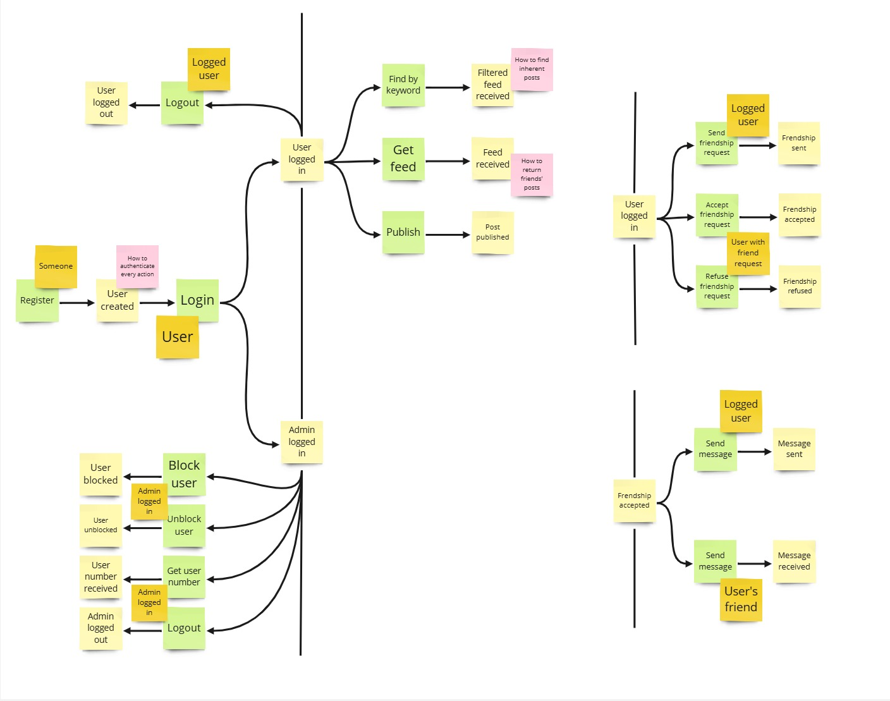
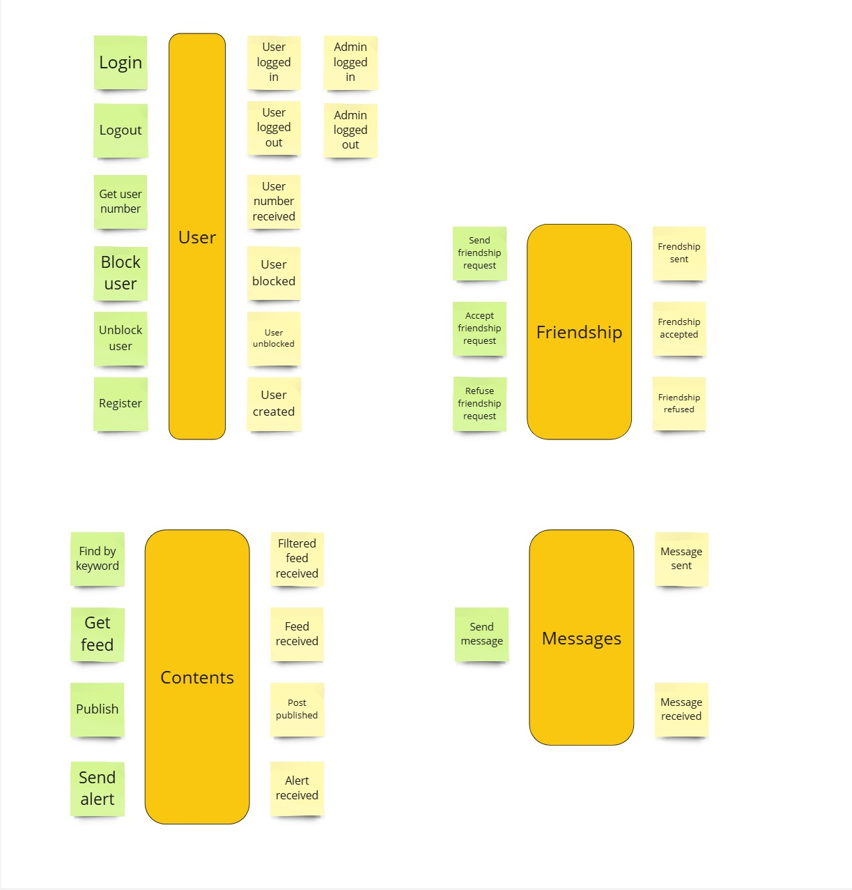

# Event Storming
Our knowledge-crunching sessions have continued using the Event Storming approach, 
leveraging a collaborative board and post-it notes to identify the system's main components and interactions. 
The process is iterative, and all steps are detailed in the following sections.

The sessions were conducted using the Miro platform.

# Unstructured Exploration
During the first iteration, each team member write possible domain events that could happen in the system, 
at put it on the board, without any specific order.

# Timeline
Domain events are now organized in the order in which they occur in the business domain.

# Pain Points
The team tries to identify pain points in the system, spotting possible process that require attention.

# Pivotal Points
The team identifies pivotal points in the system, where the system could be split in different bounded contexts.

# Commands
The team now identifies and describes the command that trigger the event or flow of events, 
describing the system’s operations. 
In addition, has been specified also the actor whose trigger the command.

# Policies
The team identifies the policies, commands without an actor, that are executed within the system.

# Aggregates
Now, once all the events and commands are represented, they are grouped into aggregates.

# Bounded Contexts
Finally, the team identifies the bounded contexts, the boundaries of the system, 
where each bounded context is a separate domain model.

The identified bounded contexts are:

`Friendships`: everything related to the friendships between users and their messages.\
`Users`: everything related to the users, authentication and access to app features.\
`Contents`: everything related to posts.

[« Back to Index](../docs.md) | [« Previous](../analysis/requirements.md) | [Next »](./bounded-context.md)