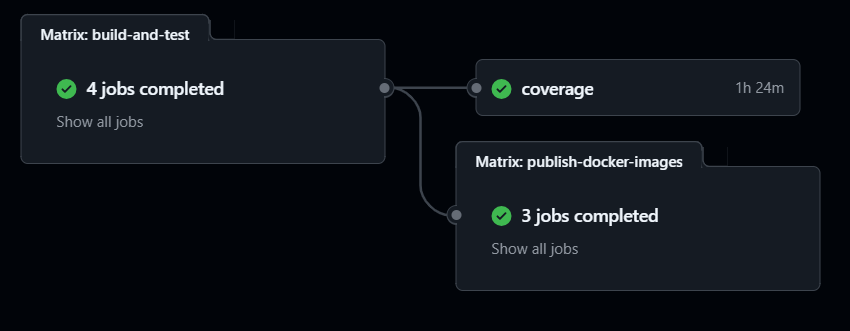

# CI / CD
The Continuous Integration (CI) and Continuous Deployment (CD) processes are essential parts 
of a DevOps software development lifecycle.

During the CI process, the code is automatically built, tested, and analyzed every time a developer 
pushes code to the repository. In our case there are two branches that can trigger the process: `main` and `dev`. 
This process helps to catch bugs early in the development cycle and ensures that the codebase 
is always in a deployable state.

The project uses GitHub Actions to realize a CI/CD process. 
GitHub Actions is a powerful tool that allows automating the software development workflow 
directly in the GitHub repository.

## CI / CD Action
The file `.github/workflows/ci-cd.yml` contains the configuration for the entire CI/CD process. 
This action performs build, test and delivery tasks.



### Build And Test
```yaml
build-and-test:
  strategy:
    matrix:
      os:
        - ubuntu-24.04
        # - macos-14
        # - windows-2022
      java-version: [17, 21]
      java-distribution: [corretto, temurin]
  runs-on: ${{ matrix.os }}
  concurrency:
    group: build-${{ github.workflow }}-${{ matrix.os }}-${{ matrix.java-version }}-${{ matrix.java-distribution }}-${{ github.event.number || github.ref }}
    cancel-in-progress: true
  steps:
    - name: Checkout
      uses: actions/checkout@v4.2.2

      
    - name: Build using Gradle
      uses: DanySK/build-check-deploy-gradle-action@3.5.25
      with:
        pre-build-command: |
          echo -n "${{ secrets.DB_PASSWORD }}" > db-password.txt
          echo -n "${{ secrets.DB_ROOT_PASSWORD }}" > db-root-password.txt
        java-version: ${{ matrix.java-version }}
        java-distribution: ${{ matrix.java-distribution }}
        should-run-codecov: false
        retries-on-failure: 3
```
The job builds the entire project and subsequently runs all tests.

The job's configuration is determined by the Cartesian product of:

- os
- java-version
- java-distribution

This ensures correct functionality is verified for every configuration.
Due to the tests that utilize Docker, the job cannot be executed on Windows or macOS, 
as these platforms currently do not fully support this technology.

The `cancel-in-progress` flag, set to true, ensures that processes are terminated if a more recent commit is detected.

The steps include:

- **Checkout**: Clones the repository onto the virtual machine (runner) where the job is executed, enabling subsequent steps.
- **Build using Gradle**: Utilizes an external action to build and test the project. Notably, 
the `pre-build-command` writes two GitHub secrets to a file, making them accessible during the tests.

### Publish Docker Images
```yaml
publish-docker-images:
    needs: build-and-test
    runs-on: ubuntu-latest
    strategy:
      matrix:
        service:
          - "friendship-service"
          - "content-service"
          - "user-service"
    steps:
      - name: Checkout
        uses: actions/checkout@v4
      
      - name: Build service ${{ matrix.service }}
        uses: DanySK/build-check-deploy-gradle-action@3.7.0
        with:
          should-run-codecov: false
          build-command: |
            if [ "${{ matrix.service }}" == "content-service" ]; then./gradlew :${{ matrix.service }}:compileTypescript
            else./gradlew :${{ matrix.service }}:assemble
            fi
          check-command: ":"
      
      - name: Login to Docker Hub
        uses: docker/login-action@v3
        with:
          username: ${{ secrets.DOCKER_USERNAME }}
          password: ${{ secrets.DOCKER_PASSWORD }}
      
      - name: Build and push ${{ matrix.service }} image
        uses: docker/build-push-action@v6
        with:
          context: ./${{ matrix.service }}
          push: true
          tags: |
            marcofontana17/social-network-${{ matrix.service }}:latest
            marcofontana17/social-network-${{ matrix.service }}:${{ github.sha }}
```
This job is responsible for the automatic publishing of microservice images to DockerHub.

The necessary steps are:

- **Checkout**: Clones the repository to the virtual machine (runner) for further execution.
- **Build Service**: Builds the various microservices. Note that the build-command is conditional, 
meaning it executes different Gradle tasks depending on the subproject being processed, `assemble` task for JVM ones and
`compileTypescript` for NodeJS.
- **Login To Docker Hub**: Logs into the platform using a username and password stored as secrets.
- **Build and Push**: Actually publishes the built images.

It is important to note that this job depends on the previous one, so it is not necessary to re-run the tests 
(the `assemble task`) during the build.

### Coverage
```yaml
coverage:
    needs: build-and-test
    runs-on: ubuntu-latest
    steps:
      
    - name: Checkout
      uses: actions/checkout@v4.2.2
      
    - name: Generate coverage report
      uses: DanySK/build-check-deploy-gradle-action@3.5.25
      with:
        pre-build-command: |
          echo -n "${{ secrets.DB_PASSWORD }}" > db-password.txt
          echo -n "${{ secrets.DB_ROOT_PASSWORD }}" > db-root-password.txt
        should-run-codecov: false
        check-command: "./gradlew koverXmlReportAggregated --parallel"
        retries-on-failure: 3
        
    - name: Push coverage report
      uses: codecov/codecov-action@v5.2.0
      with:
        files: ./build/reports/kover/reportAggregated.xml
        verbose: true
        slug: GiacomoRomagnoli/Social-Network
      env:
        CODECOV_TOKEN: ${{ secrets.CODECOV_TOKEN }}
```
The final job also depends on Build and Test and is responsible for generating coverage reports and publishing 
them on CodeCov to verify the coverage of the tests.

The necessary steps are:

- **Checkout**: Clones the repository to the virtual machine (runner).
- **Generate Coverage Report**: Produces the reports using `Kover`, through `koverXmlReportAggregated` task 
that aggregates all coverage reports generated in a single file.
- **Push Coverage Report**: Publishes the generated reports to CodeCov using a token stored as a secret.

## GitHub Pages
To keep the project updated over time, the GitHub Pages mechanism was utilized to distribute all documentation produced 
during development. This GitHub feature allows developers to host a web server that serves their documentation, 
automatically updating the hosted documents with each push that modifies them.