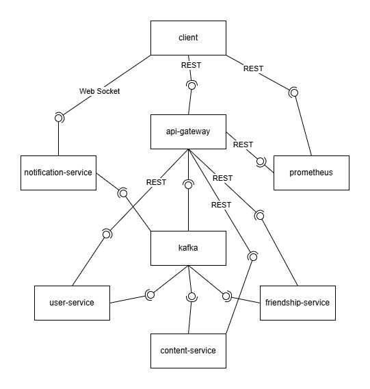
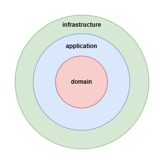

# The Big Picture
Below is a component-and-connector diagram describing the implemented architecture.
This architecture consists of three microservices, each aligned with a distinct bounded context, 
and an API gateway that serves as the single entry point to the system. 
The decision to introduce an event broker stems from the need to achieve eventual consistency through event sourcing. 
Furthermore, by simply adding a proxy that exposes a WebSocket interface, 
clients can listen for relevant events and receive real-time notifications. 
Prometheus has been integrated to provide system metrics to the client, 
which are exposed via a REST interface from the API gateway.

From a persistence perspective, each service relies on a database isolated from the rest of the system, 
allowing each service to scale independently of the others.

## Clean Architecture

The various microservices are developed following the principles of clean architecture. In our implementation of the hexagonal architecture, three layers are defined:

- Infrastructure
- Application
- Domain

As per the principles, the outer layers depend on the inner layers, but not vice versa.
As shown in the figure, the outermost layer is Infrastructure, followed by Application, with Domain at the core.

### Domain
This layer contains the entities, the value objects, the domain's aggregate roots, and the factories. For implementation purposes,
the factories are represented by static methods.

### Application
This layer contains the business logic, implemented in DDD services. It is important to note that these services naturally 
depend on repositories. However, to adhere to clean architecture principles, only the repository interfaces 
are included in this layer, effectively abstracting the underlying implementation technologies. 
A similar approach has been applied to event producers, whose interface is also located in this layer.

### Infrastructure
This layer is solely responsible for external communication.
It includes the implementations of repositories and event producers, as well as REST APIs and event consumers.

[« Back to Index](../docs.md) | [« Previous](./ddd.md) | [Next »](./testing.md)